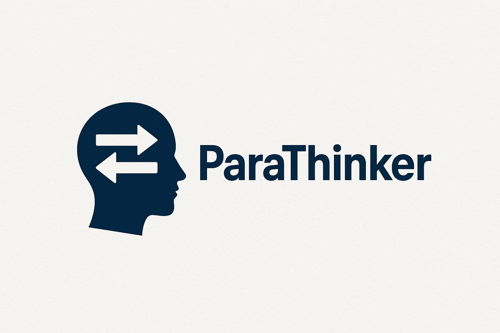
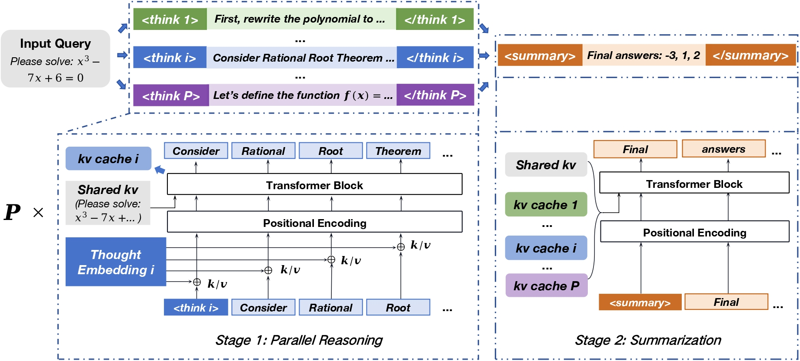
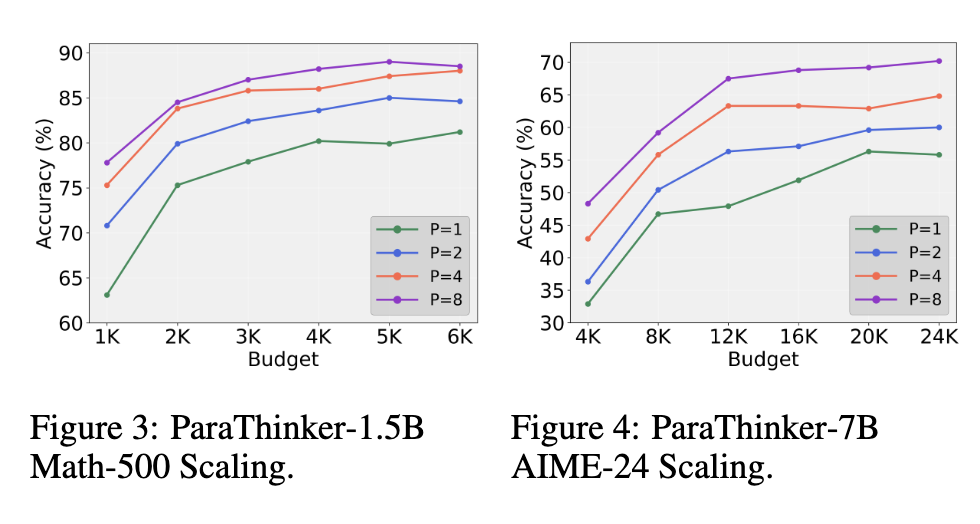

<div align="center">

# ParaThinker: Native Parallel Thinking as a New Paradigm to Scale LLM Test-time Compute

[](https://arxiv.org/abs/2509.04475)
[](https://huggingface.co/Leslie04/ParaThinker-1.5B)
[](https://huggingface.co/datasets/Leslie04/parathinker-math-6K)

<div align="center">

</div>

<p align="center">
    💡&nbsp;<a href="#-key-findings">Key Findings</a>
    | 📈&nbsp;<a href="#-scaling-results">Scaling Results</a>
    | 🔥&nbsp;<a href="#-models">Models(infer & SFT)</a>
    | 📝&nbsp;<a href="#-open-source-list">Open Source List</a>
</p>

</div>

## Updates

- **[2025-11-01]** 🎉 Released the [parathinker-math-6K dataset](https://huggingface.co/datasets/Leslie04/parathinker-math-6K) and [training scripts](https://github.com/MobileLLM/ParaThinker?tab=readme-ov-file#quick-start-sft-for-parathinker-15b).
- **[2025-10-02]** 🚀 Updated the inference engine and released the improved [ParaThinker-1.5B model](https://huggingface.co/Leslie04/ParaThinker-1.5B).

---

## 🌟 About

- Recent advances in Large Language Models (LLMs) have been driven by test-time compute scaling - a strategy that improves reasoning by generating longer, sequential thought processes.
- However, this approach hits a bottleneck where further computation offers only marginal gains, due to "Tunnel Vision" where imperfect initial steps lock the model into suboptimal paths.
- We introduce **ParaThinker**, an end-to-end framework that trains LLMs to generate multiple, diverse reasoning paths in parallel and synthesize them into a superior final answer.
- Scaling compute in parallel (width) proves more effective and efficient than sequentially (depth).

<div align="center">

</div>

---

## 💡 Key Findings

Here are the core insights from our analysis and evaluations:

📈 **Superior Accuracy Gains**: On challenging reasoning benchmarks (AIME 2024/2025, AMC 2023, MATH-500), ParaThinker achieves 12.3% improvement for 1.5B models and 7.5% for 7B models on average with 8 parallel paths.

✅ **Overcomes Tunnel Vision**: The bottleneck in sequential reasoning arises from early token choices committing to flawed paths; parallelism enables diverse exploration to break through.

🧠 **Native Parallelism in a Single Pass**: Using specialized control tokens (<think i>), thought-specific positional embeddings, and two-phase attention, ParaThinker generates and integrates paths end-to-end without external verifiers.

⚡ **Minimal Latency Overhead**: Adds only 7.1% latency on average, leveraging batching for hardware efficiency; 16 paths take <2x time of a single path.

🧱 **Scalable SFT Training**: Supervised fine-tuning with paths from a teacher model enables generalization to more paths at inference.

🔁 **Smaller Models Outperform Larger Ones**: ParaThinker-equipped small LLMs surpass larger sequential counterparts, offering a new scaling dimension.

We would release the full code for training and inference, along with evaluation scripts. Checkpoints for ParaThinker-1.5B are available on [🤗 HuggingFace](https://huggingface.co/Leslie04/ParaThinker-1.5B).

---

## 📈 Scaling Results

Evaluated on math reasoning tasks, scaling parallel paths `P` from 1 to 8.

<div align="center">

</div>

---

## 🔥 Models

ParaThinker models based on DeepSeek-R1-Distill-Qwen versions:

| Model            | Description                       | Download                                                     |
| ---------------- | --------------------------------- | ------------------------------------------------------------ |
| ParaThinker-1.5B | Fine-tuned for parallel reasoning | [🤗 Leslie04/ParaThinker-1.5B](https://huggingface.co/Leslie04/ParaThinker-1.5B) |
| ParaThinker-7B   | Higher-capacity for complex tasks | [🤗 Leslie04/ParaThinker-7B](https://huggingface.co/Leslie04/ParaThinker-7B) (coming soon) |


### Usage Example with Inference Engine for ParaThinker

For efficient parallel inference using our customized vLLM engine, refer to the [Inference Submodule README](https://github.com/LeslieKid/vllm-parathinker/blob/d30de3c71c49e08ea0944ba6586788fdf53ea4e6/README.md). This submodule implements the native parallel thinking inference engine, leveraging PagedAttention for KV cache reuse. Also see the quick start example in [`inference/examples/parathinker/example.py`](https://github.com/LeslieKid/vllm-parathinker/blob/d30de3c71c49e08ea0944ba6586788fdf53ea4e6/examples/parathinker/example.py) for usage.

### Quick Start: SFT for ParaThinker-1.5B

We use custom [LLaMA-Factory](https://github.com/hiyouga/LLaMA-Factory) to train native parallel thinking model.

**Build Conda Environment:** The following is a simplest script to build a conda environment for ParaThinker training:
```sh
set -e 

eval "$(conda shell.bash hook)"
if ! conda env list | grep -q "parathinker-sft"; then
    conda create -n parathinker-sft python=3.11
fi

conda activate parathinker-sft

cd ./train/LLaMA-Factory
pip install -e ".[torch,metrics]"

cd ../transformers
pip install -e .
```

**Dataset Installation and SFT Running:** Install [parathinker-math-6K dataset](https://huggingface.co/datasets/Leslie04/parathinker-math-6K) and then use the [example training script](./train/scripts/ds-1.5b-full.sh) to quickly start a SFT on [deepseek-ai/DeepSeek-R1-Distill-Qwen-1.5B](https://huggingface.co/deepseek-ai/DeepSeek-R1-Distill-Qwen-1.5B).

---

## 📝 Open Source List
- [x] Inference Engine based on vLLM
- [x] ParaThinker-1.5B Model
- [ ] ParaThinker-7B Model
- [x] SFT dataset and training script based on llama-factory
- [ ] Evaluation script
